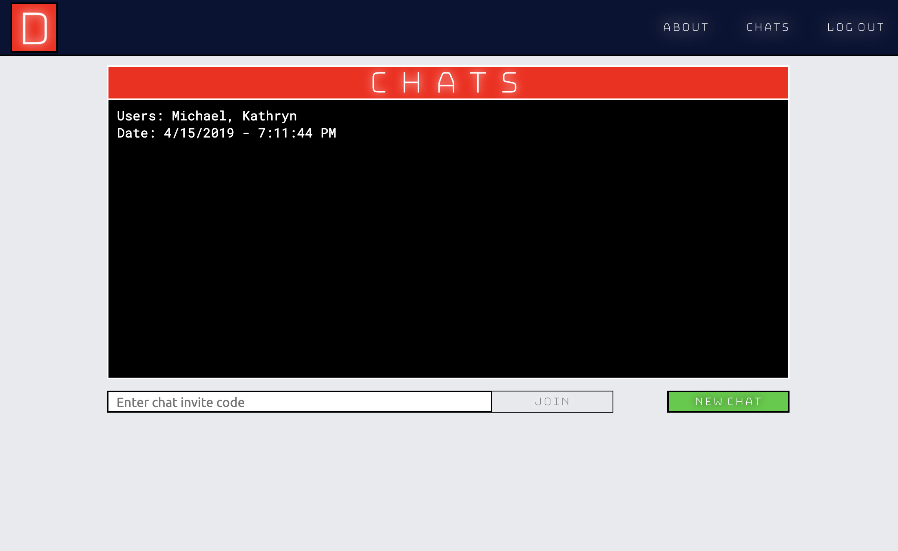
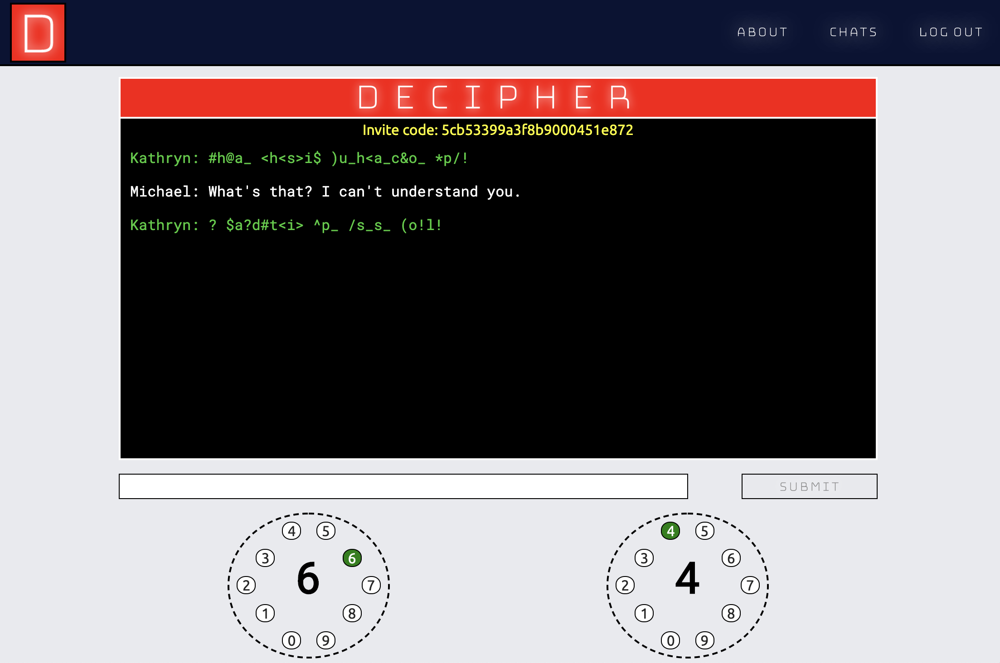
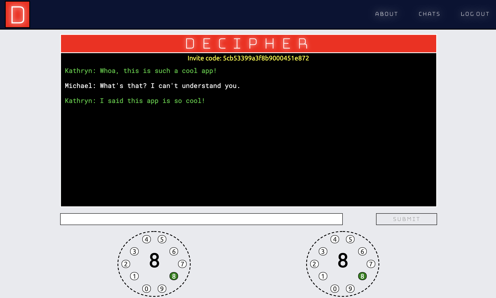

# Decipher
## Introduction
Welcome to Decipher, a one-of-a-kind interactive chat experience!

To start, create a chat, and send the invite code to a friend. 

When a chat begins, the other person’s messages will be scrambled. To decipher them, you must adjust the settings of the dials on the bottom of your screen.

As you get closer to the correct setting, the incoming messages will start to descramble, one character at a time. Once you crack the code, the messages will be completely descrambled.

We hope you enjoy Decipher!

## Technologies Used

Decipher is a full stack web application built using MongoDB, Express, Node, and React.

I used the jsonwebtoken and bcrypt node modules for authentication and password hashing, React Router for client-side routing, and socket.io to facilitate real time chat features.

Page layouts were designed using CSS Flexbox and Grid. Mongoose was used for database object modeling.

## Getting Started

I began this project by planning my user stories using [Trello](https://trello.com/b/DO6qWiOr/decipher).

You can also find my initial wireframes and Entity Relationship Diagram there.

The app is deployed on [Heroku](https://decipher-md.herokuapp.com/).

## Unsolved Problems

There are some minor issues with the styling of the descrambler dials (the buttons are not perfect circles on some screen sizes) that I would like to refactor and fix.

I would also like to re-organize my CSS so that the use of CSS modules or standard .css files is consistent.

Additionally, currently the unscrambled messages and descrambler keys are stored in state on a React component. If a user were so inclined, they could use the React Dev Tools to spoil the fun. I would like to refactor to store these items in memory, making them more difficult to access.

## Future Enhancements

Given more time, I would like to implement the ability for a user to remove themself from a chat in their chats log.

Additionally, I would like for the application to use geolocation to calculate the physical distance between the users, and increase the scramble level based on how far away the users are.